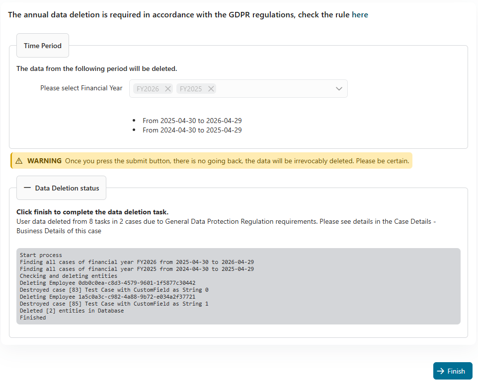
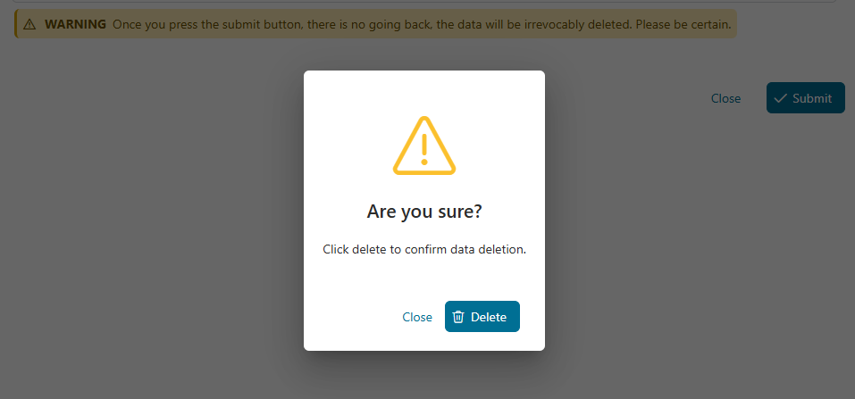
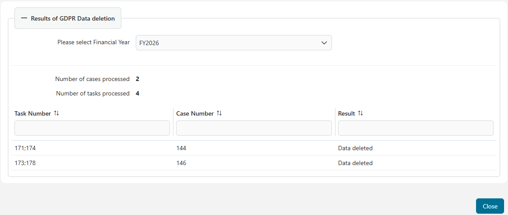

# GDPR Utils

The **GDPR (General Data Protection Regulation)** is an EU regulation that governs the protection of personal data within the **EU and EEA**. Key features include an expanded scope, strict consent requirements, data breach notifications, and the **principle of storage limitation**, which mandates that personal data must only be retained as long as necessary for the original purpose. In this context, the **"Right to be Forgotten" (Art. 17 GDPR)** allows individuals to request data deletion when it is no longer needed. To support compliance, this tool  automates the deletion of  data older than a defined time intervall.


- **Create a job that sends reminders to delete data at defined intervals.**  
- **Define exactly which data should be deleted**, e.g., only data with a certain status. Data related to tasks that are old but still in progress should not be deleted. Also, specify the exact time interval for data deletion.  
- **Handle business cases involving deleted data**: The business case remains available, but it is indicated that the linked data has been deleted in compliance with GDPR.  
- **Receive a summary of the deletion process** In our implementation, data deletion is intended to be performed manually to give system administrators control over the process - you get a short report about the number of datasets deleted.



## Demo

## 1. Executing the deletion process

This section creates dummy data (`Financial Data`) for demonstrating the deletion process. The project contains 2 entities class: Company and Employee.

In detail, the Company was designed with an ID type Integer, and Employee was designed as String, so the job will delete one of them based on what you configured in `gdpr.EntityCustomField.Name` variable.

### 1.1 Prepare data

* First of all, we need some dummy data, let's do it by running the **Create Dummy data**(`gdpr-utils-demo/1948C6200884AE99/startCreateDummyData.ivp`) process.
* Then, run the **Manual trigger the General Data Protection Regulation process**(`gdpr-utils/1943EA22591E28D4/startDataDeletion.ivp`) process. It will create a case named **"General Data Protection Regulation process"**, and a task will be generated and assigned to the **GDPR Administrator** role.

### 1.2 General Data Protection Regulation task

You can use the **Developer** account to start the **"General Data Protection Regulation"** task.

* When the GDPR Admin presses the `Submit` button, the data will be **prepared** to be deleted from the database. A confirmation popup will appear to ensure that the action is intentional.

  

However, the data will only be permanently deleted from the database when the Admin presses the `Delete` button.
  
  

The output of the process will look like this:

  

## 2. Check the business case details

You can check the `Business Case Details` of this process later by starting the **Data deletion summary**(`gdpr-utils/1943EA22591E28D4/startSummaryPage.ivp`) process or opening it in the Portal - if data are deleted it is mentioned here. 



## Setup

This util is designed as a CronJob, so basically it will be trigged one time per year and assign tasks to the `GDPR Administrator` role.
You properly can change the time and also the schedule when the job should be triggered by `gdpr.DataDeletionCronJobPattern` variable.
Make sure that you assign your user to the `GDPR Administrator` role then they can see and work on the task.

* The job find the corresponding the ivy cases that match with your config in `gdpr.CustomFieldsInScope` file.
* Then the found ivy case and task will be destroyed.
* For the business data that your application saved to the Database layer, e.g: postgres DB, then you must config:
  * The `gdpr.EntityCustomField` to define which custom field name of the ivy case that saved the entity Id.
    * Type should be `STRING` or `NUMBER`.
  * The `gdpr.PersistenceUnitName` to define the persistence unit name that contained all your entities, then the job can create an EntityManager based on that name, and find the entity by id which is saved in the `gdpr.EntityCustomField` custom field.
    * You can check the config in `<your-project>/config/persistence.xml`

Read the full variable for more details:

```
@variables.yaml@
```

The `CustomFieldsInScope.json` file can be found in `config/variables/gdpr/CustomFieldsInScope.json`

```
    // Sample dataset: [{"name" : "MyKey", "type" : "String", "value" : "MyValue"}]
    [
        {
            "name" : "LegalEntity", // The axonivy case's custom field name that this job should be focused on
            "type" : "String", // The type of case's custom field, it should be "String" or "Number"
            "value" : "RDE" // The value of case's custom field
        }
    ]
```
