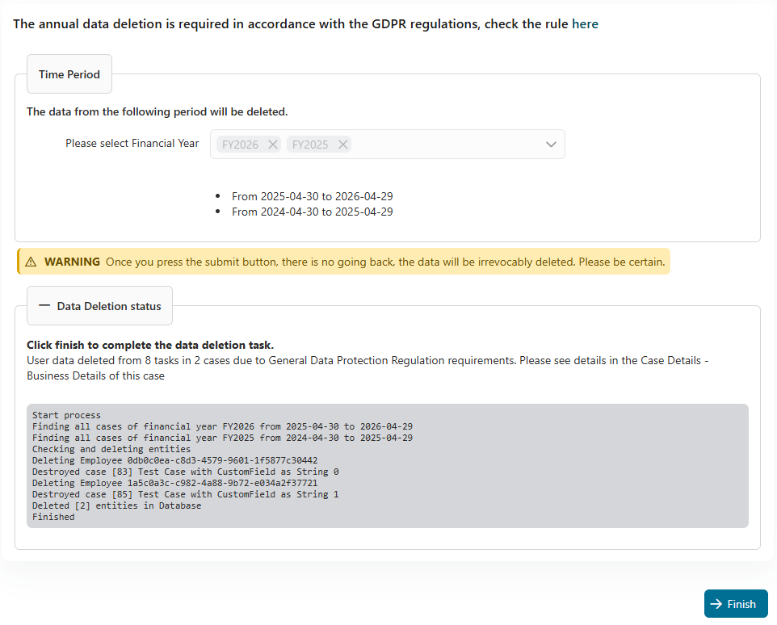
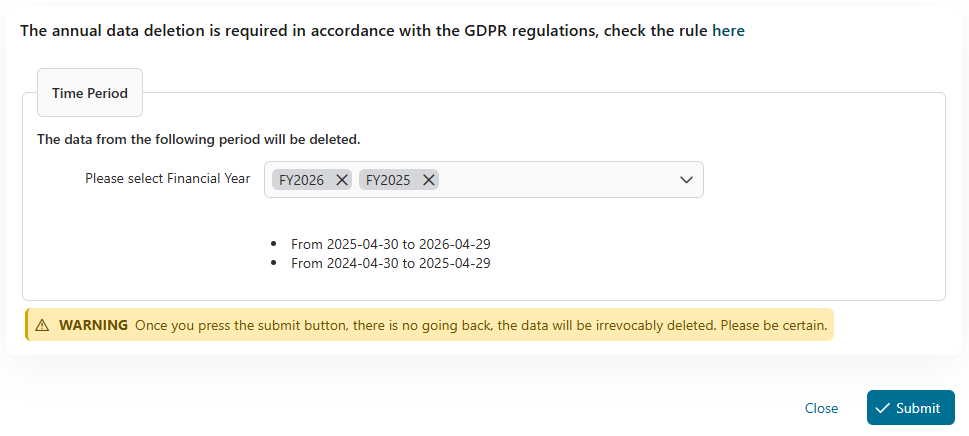
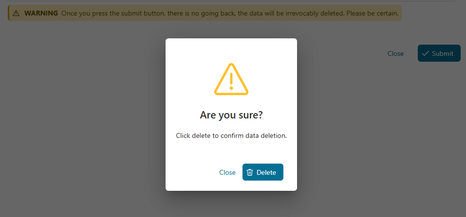
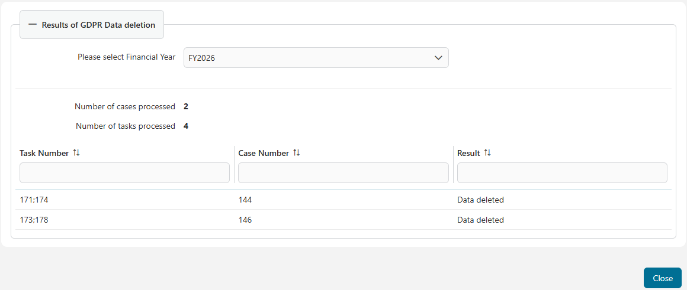

# GDPR Utils

The **GDPR (General Data Protection Regulation)** is an EU regulation that
governs the protection of personal data within the **EU and EEA**. Key features
include an expanded scope, strict consent requirements, data breach
notifications, and the **principle of storage limitation**, which mandates that
personal data must only be retained as long as necessary for the original
purpose. In this context, the **"Right to be Forgotten" (Art. 17 GDPR)** allows
individuals to request data deletion when it is no longer needed. To support
compliance, this tool automates the deletion of data older than a defined time
interval.


- **Erstellen Sie einen Job, der in festgelegten Intervallen Erinnerungen zum
  Löschen von Daten versendet.**
- **Legen Sie genau fest, welche Daten gelöscht werden sollen**, z. B. nur Daten
  mit einem bestimmten Status. Daten zu Aufgaben, die alt sind, aber noch in
  Bearbeitung sind, sollten nicht gelöscht werden. Geben Sie außerdem das genaue
  Zeitintervall für die Datenlöschung an.
- **Behandeln Sie Geschäftsfälle mit gelöschten Daten**: Der Geschäftsfalle
  bleibt verfügbar, es wird jedoch darauf hingewiesen, dass die verknüpften
  Daten gemäß DSGVO gelöscht wurden.
- **Erhalten Sie eine Zusammenfassung des Löschvorgangs** In unserer
  Implementierung soll die Datenlöschung manuell durchgeführt werden, damit
  Systemadministratoren die Kontrolle über den Vorgang haben – Sie erhalten
  einen kurzen Bericht über die Anzahl der gelöschten Datensätze.



## Demo

## 1. Ausführen des Löschvorgangs

In diesem Abschnitt werden Dummy-Daten (`Finanzdaten`) erstellt, um den
Löschvorgang zu veranschaulichen. Das Projekt enthält zwei Entitätsklassen:
Unternehmen und Mitarbeiter.

Im Einzelnen wurde das Unternehmen mit einem ID-Typ Integer und der Mitarbeiter
als String konfiguriert, sodass der Job einen der beiden basierend auf Ihrer
Konfiguration in den Variablen „ `gdpr.EntityCustomField.Name” und „` ” löscht.

### 1.1 Daten vorbereiten

* Zunächst benötigen wir einige Dummy-Daten. Dazu führen wir den Prozess „
  **Create Dummy data** ”
  (`gdpr-utils-demo/1948C6200884AE99/startCreateDummyData.ivp`) aus.
* Führen Sie dann das Handbuch „ **“ aus und lösen Sie den Prozess „General Data
  Protection Regulation“
  (**(`gdpr-utils/1943EA22591E28D4/startDataDeletion.ivp`) aus. Dadurch wird ein
  Fall mit dem Namen „ ** “ („General Data Protection Regulation process“)**
  erstellt und eine Aufgabe generiert, die der Rolle „ **“ („GDPR
  Administrator“)** zugewiesen wird.

### 1.2 Aufgabe gemäß Datenschutz-Grundverordnung

Sie können das Entwicklerkonto „ **“** verwenden, um die Aufgabe „ ** „General
Data Protection Regulation“** “ zu starten.

* ` Wenn der GDPR-Administrator auf die Schaltfläche „ `“ (Daten aus der
  Datenbank löschen) klickt, werden die Daten **prepared** aus der Datenbank
  gelöscht. Es erscheint ein Bestätigungsfenster, um sicherzustellen, dass die
  Aktion beabsichtigt ist.

  

Die Daten werden jedoch erst dann dauerhaft aus der Datenbank gelöscht, wenn der
Administrator auf die Schaltfläche „ `“ (Löschen) unter „` “ (Datenbank) klickt.



Das Ergebnis des Prozesses sieht wie folgt aus:


## 2. Überprüfen Sie die Details des Business Case.

Sie können die Details des Geschäftsfalls „ `”` dieses Prozesses später
überprüfen, indem Sie den Prozess „
**”**(`gdpr-utils/1943EA22591E28D4/startSummaryPage.ivp`) starten oder im Portal
öffnen – wenn Daten gelöscht wurden, wird dies hier erwähnt.



## Setup

This util is designed as a CronJob, so basically it will be triggered one time
per year and assign tasks to the `GDPR Administrator` role. You properly can
change the time and also the schedule when the job should be triggered by
`gdpr.DataDeletionCronJobPattern` variable. Make sure that you assign your user
to the `GDPR Administrator` role then they can see and work on the task.

* Die Aufgabe besteht darin, die entsprechenden Ivy-Fälle zu finden, die mit
  Ihrer Konfiguration in der Datei „ `gdpr.CustomFieldsInScope` ”
  übereinstimmen.
* Dann werden der gefundene Ivy-Fall und die Aufgabe zerstört.
* Für die Geschäftsdaten, die Ihre Anwendung in der Datenbankebene gespeichert
  hat, z. B. in einer Postgres-Datenbank, müssen Sie Folgendes konfigurieren:
  * Die Datei „ `“ und „gdpr.EntityCustomField“` definieren, welcher
    benutzerdefinierte Feldname des Ivy-Falls die Entitäts-ID gespeichert hat.
    * Der Typ sollte `STRING` oder `NUMBER` lauten.
  * Die Datei „ `“ gdpr.PersistenceUnitName` definiert den Namen der
    Persistenz-Einheit, die alle Ihre Entitäten enthält. Anschließend kann der
    Job einen EntityManager basierend auf diesem Namen erstellen und die Entität
    anhand der ID finden, die in der Datei „ `“ gdpr.EntityCustomField` im
    benutzerdefinierten Feld gespeichert ist.
    * Sie können die Konfiguration unter `/config/persistence.xml überprüfen.`

Weitere Informationen finden Sie in der vollständigen Variablenbeschreibung:

```
@variables.yaml@
```

Die Datei „ `CustomFieldsInScope.json” (` ) finden Sie unter „
`config/variables/gdpr/CustomFieldsInScope.json”.`

```
// Sample dataset: [{"name" : "MyKey", "type" : "String", "value" : "MyValue"}]
    [
        {
            "name" : "LegalEntity", // The axonivy case's custom field name that this job should be focused on
            "type" : "String", // The type of case's custom field, it should be "String" or "Number"
            "value" : "RDE" // The value of case's custom field
        }
    ]
```
