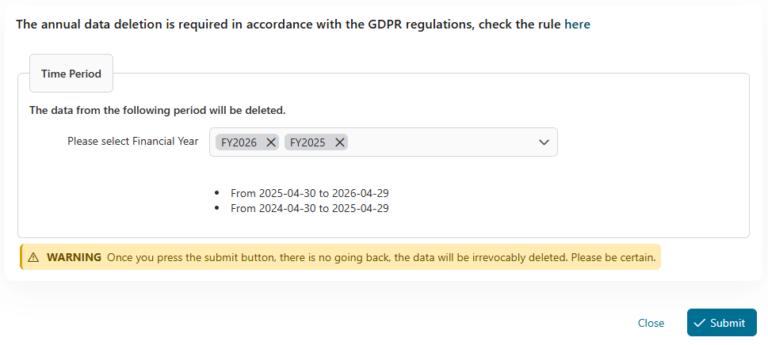

# GDPR Utils

Das **GDPR (Allgemeiner #Daten Schutz Regelung)** ist eine #EU Regelung jener
regiert den Schutz von persönlich #Daten #innerhalb #der **#EU und EEA**.
Wesentliche Charakterzüge einschließen #ein expandiert Anwendungsbereich,
strenge Zusage Forderungen, #Daten Bresche Mitteilungen, und die **Prinzip von
Speicher Begrenzung**, #welche #mandatieren dass #persönlich #Daten muss nur
sein festgehalten #solange nötig für den originalen Zweck. In diesem Kontext,
dem **"Recht zu sein Vergessen" (Kunst. 17 GDPR)** erlaubt Individuen zu
auffordern #wann #Daten Löschung es ist nicht mehr brauchte. Zu unterstützen
Zustimmung, dieses Tool automatisiert die Löschung Daten älter als eine
#abgesteckt Zeit intervall.


- **Schafft einen Beruf jener sendet Winke zu streichen #Daten an #abgesteckt
  Intervalle.**
- **Definieren genau #welche Daten sollten sein gestrichen**, #z.B., #einzige
  #Daten mit einem gewissen Zustand. #Daten erzählt zu beschäftigen jener ist
  alt aber noch sollte nicht in Fortgang sein gestrichen. Auch, präzisier die
  exakte Zeit Intervall für Daten Löschung.
- **Bedienen dienstliche Fälle involvierend gestrichen #Daten**: Der dienstliche
  Fall #Überreste verfügbar, aber es ist #hindeuten dass die verbunden #Daten
  hat gewesen gestrichen #entsprechend GDPR.
- **Empfängt eine Übersicht von den Löschung Arbeitsgang** In unserer
  Ausführung, #Daten Löschung ist #vorhaben zu sein aufgeführt manuell System
  Administratoren zu geben Aufsicht über den Arbeitsgang - du bekommst einen
  kurzen Bericht von die Nummer von datasets strich.


## Demo

## 1. Exekutierend den Löschung Arbeitsgang

Diese Sektion schafft Dummkopf #Daten (`#Finanziell #Daten`) für demonstrieren
den Löschung Arbeitsgang. Das Projekt zügelt 2 Entitäten Klasse: Gesellschaft
und Angestellte.

Ausführlich, die Gesellschaft war gestaltet mit eine ID Typ #Ganzzahl, und
Angestellte war gestaltet da Schnur, so will der Beruf streichen #man von jene
gegründet auf was du konfiguriertest herein `gdpr.EntityCustomField.Name`
Variable.

### 1.1 Bereitet vor #Daten

* Zunächst, wir brauchen #einige Dummkopf #Daten, lass uns tun es mal rennen
  #der **Schafft Dummkopf
  #Daten**(`gdpr-utils-Demo/1948C6200884AE99/startCreateDummyData.ivp`)
  Arbeitsgang.
* Dann, gerannt das **Manuellen Auslöser #der #Allgemein #Daten Schutz Regelung
  Arbeitsgang**(`gdpr-utils/1943EA22591E28D4/startDataDeletion.ivp`)
  Arbeitsgang. Es will einen Fall schaffen geheißen **"Allgemeinen #Daten Schutz
  Regelung Arbeitsgang"**, und ein Task will sein generiert und zugewiesen zu
  der **GDPR Administrator** Rolle.

### 1.2 #Allgemein #Daten Schutz Regelung Task

Du kannst benutzen das **Entwickler** verrechnet zu starten den **"Allgemeinen
#Daten Schutz Regelung"** Task.

* Wann das GDPR Admin Pressen die `Unterziehen` Knopf, #der #Daten will sein
  **vorbereitet** zu sein gestrichen von der Datenbank. Eine Bestätigung popup
  will fungieren zu sichern dass die Aktion ist absichtlich.

  

Indes, #der #Daten will nur permanent sein gestrichen #wann von der Datenbank
der Admin Pressen die `Streichen` Knopf.


Die Ausgabe von dem Arbeitsgang will #aussehen dies:


## 2. Überprüf den dienstlichen Fall Details

Du kannst überprüfen das `Dienstliche Fall Details` von diesem Arbeitsgang
nachher mal starten dem **#Daten Löschung
Übersicht**(`gdpr-utils/1943EA22591E28D4/startSummaryPage.ivp`) Arbeitsgang oder
#aufklappend es in dem Portal - ob #Daten ist gestrichen ihm ist erwähnt hier.


## Einrichtung

Dies util ist gestaltet da ein CronJob, so grundlegend will es sein trigged #man
misst per Jahr und zuweisen Tasks zu die `GDPR Administrator` Rolle. Du kannst
geeignet wechseln die Zeit und #wann auch den Anhang den Beruf sollte sein
ausgelöst mal `gdpr.DataDeletionCronJobPattern` Variable. Herstellung sicher
jener du weist zu euren Nutzer zu den `GDPR Administrator` Rolle dann können sie
sehen und arbeiten auf dem Task.

* Der Beruf findet den #entsprechend den Efeu Fälle jenen Wettkampf mit eure
  config herein `gdpr.CustomFieldsInScope` Datei.
* Dann das gefunden Efeu Fall und Task will sein zerstört.
* Für #der #dienstlich #Daten dass eure Antrag speicherte zu die Datenbank
  Auflage, e.g: postgres DB, Dann musst du config:
  * Das `gdpr.EntityCustomField` Zu definieren #welche #benutzerdefiniert Feld
    Namen von den Efeu Fall speicherte jener die Entität Id.
    * Typ sollte sein `SCHNUR` oder `NUMMER`.
  * Das `gdpr.PersistenceUnitName` Zu definieren die Beharrlichkeit Einheit
    heißt jener zügelte alle eure Entitäten, dann kann der Beruf schaffen ein
    EntityManager basisbezogen auf jenem Namen, und finden mal die Entität id
    #welche ist gespeichert herein die `gdpr.EntityCustomField`
    #Benutzerdefiniert Feld.
    * Du kannst überprüfen das config herein
      `<your-project>/config/Beharrlichkeit.xml`</your-project>

Lies die volle Variable für #mehr Details:

```
@variables.yaml@
```

Das `CustomFieldsInScope.json` Datei kann sein gefunden herein
`config/Variablen/gdpr/CustomFieldsInScope.json`

```
    // Sample dataset: [{"name" : "MyKey", "type" : "String", "value" : "MyValue"}]
    [
        {
            "name" : "LegalEntity", // The axonivy case's custom field name that this job should be focused on
            "type" : "String", // The type of case's custom field, it should be "String" or "Number"
            "value" : "RDE" // The value of case's custom field
        }
    ]
```
